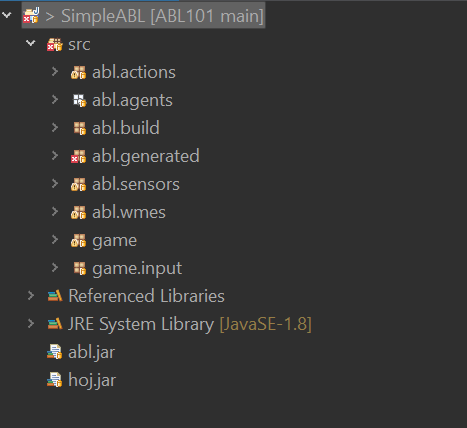
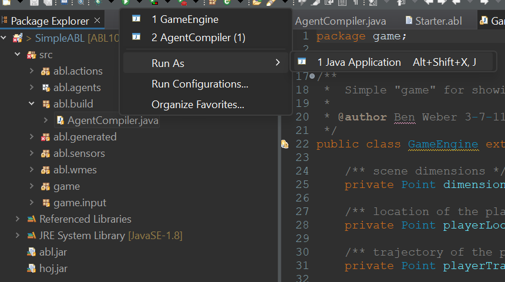
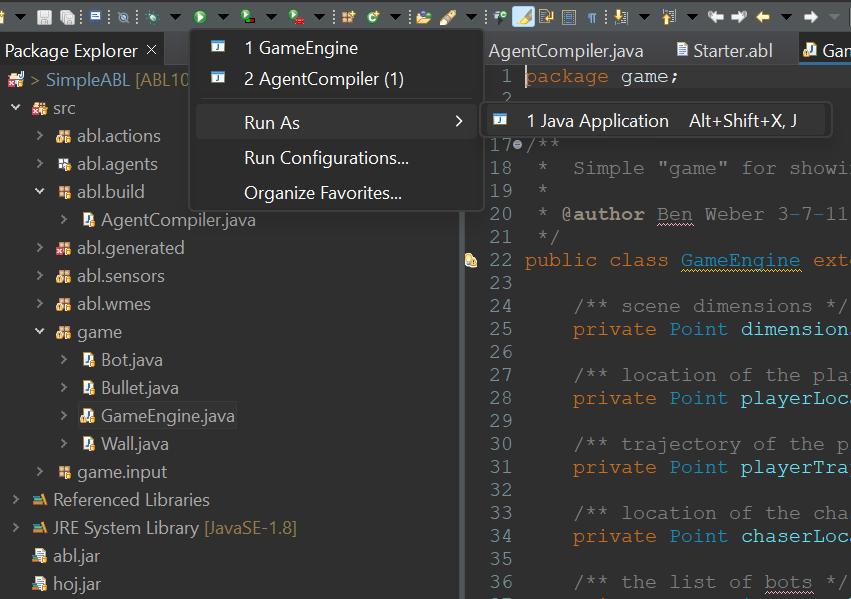
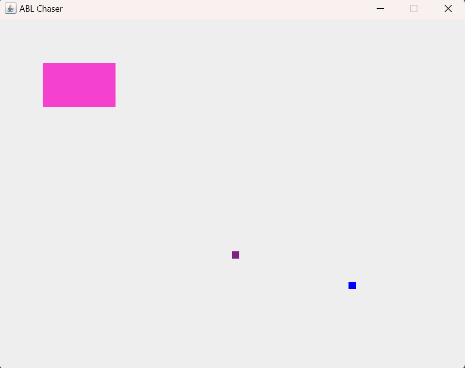

# ABL101
This is a modified Demo based off of Ben Weber's Getting Start with ABL [tutorial](https://eis-blog.soe.ucsc.edu/2012/02/getting-started-with-abl/).
# HOW TO RUN
First, download Eclipse from the [Eclipse Foundation](https://www.eclipse.org/) (do note that you do not need to pay for this program. It is a free IDE)
 
Upon installation, choose the "Eclipse IDE for Java Developers" option, as ABL is written in Java.

Next, open Eclispe and within the drop down menus, choose "File" and choose "Open Projects From File System."

Find and open the SimpleABL folder (which is nested in this repo) in Eclipse through the Open Project prompt. 

At this point the Eclipse file explorer should look something like this 

Select the AgentCompiler.java and run this file as a java application

This should build the Starter.abl agent. If there is an error then email the TA.

Now, run the gameEnigine.java as a Java Application

A new application box should appear, similar to the application image shown below

If this point has been reachehd, then congratulations, ABL development can now begin.

### Things to Note
Occasionally the agentCompiler.java will silently fail to update the compiled files. To fix this, select "abl.generated" and refresh the folder.

As for syntax highlighting, here is an explanation of associating files to editors (Do note that preferences is now within the Window drop down menu)
https://stackoverflow.com/questions/10837035/quick-way-to-set-custom-syntax-highlighting-in-eclipse

To get java syntax highlighting, create a new abl file association and then associate the abl file type to the java editor.
